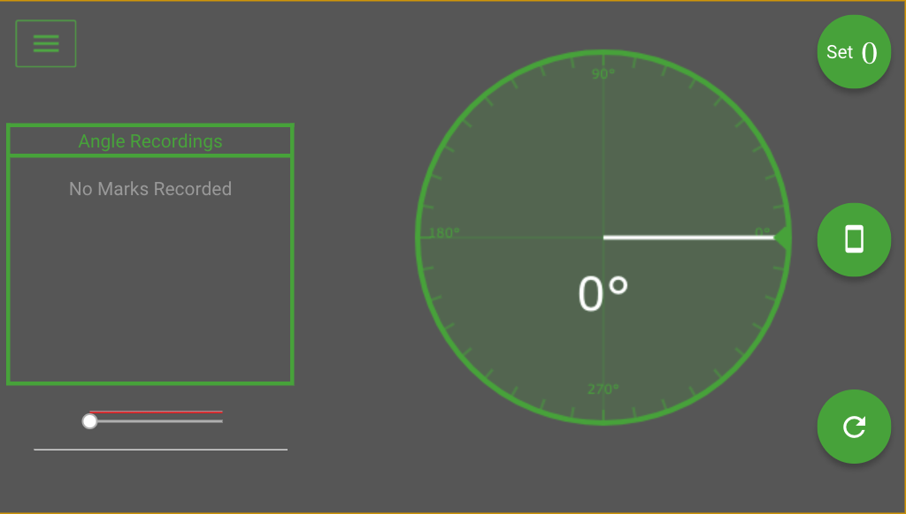
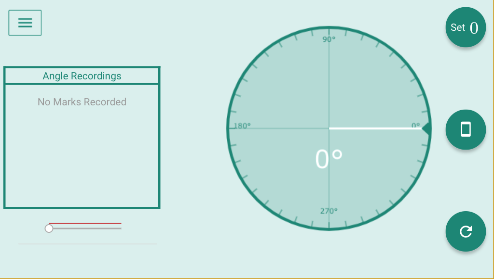
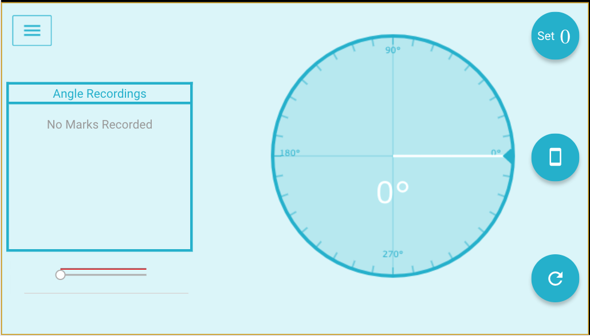
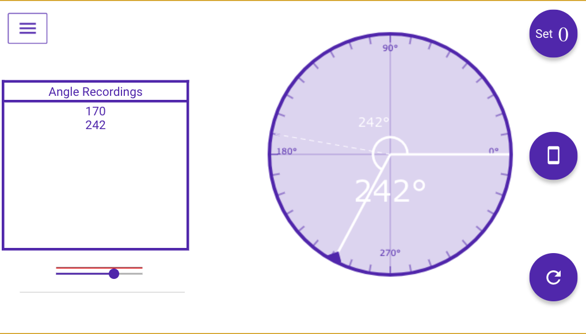

# Ganiometer App

This is an implementation using the Ionic Framework 3 of a Ganiometer app.
This project was supported by a physiotherapist, and its intended to replace the 
trivial but expensive ganiometer app available in the app store.

